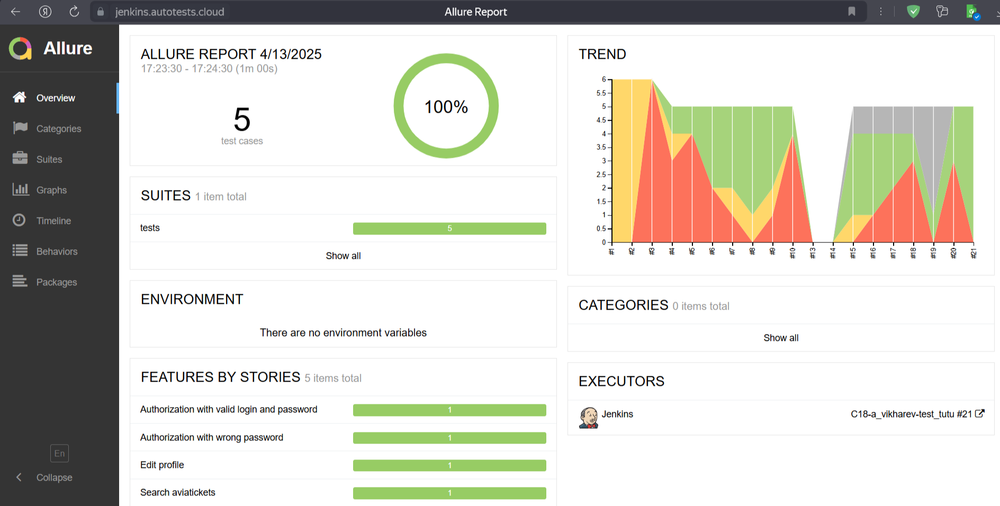
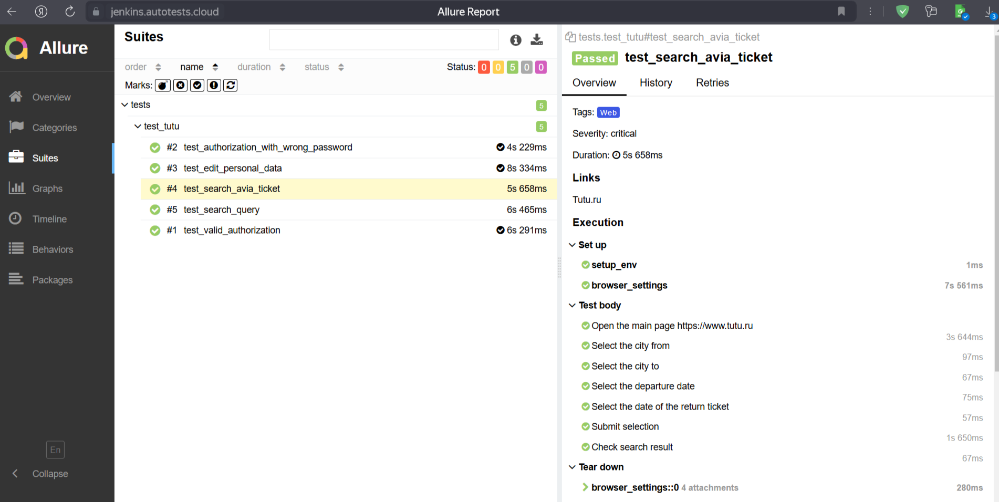
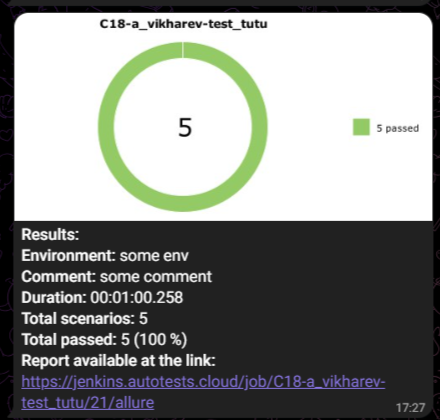
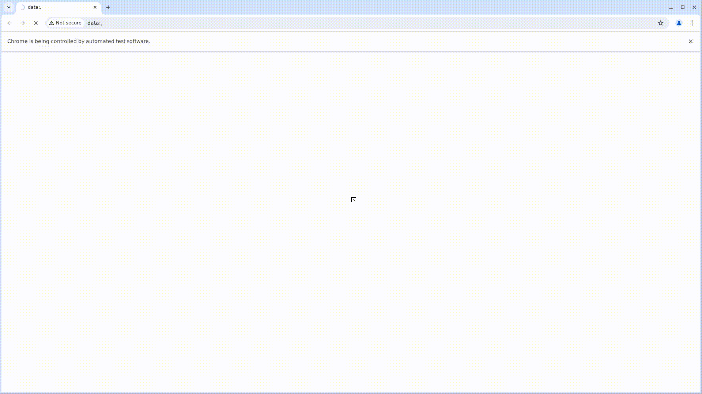

# Test_TUTU

# Проект по автоматизации тестирования онлайн-сервиса путешествий [Tutu.ru](https://www.tutu.ru)

## Содержание

- [Технологии и инструменты](#octocat-технологии-и-инструменты)
- [Список реализованных проверок в автотестах](#white_check_mark-список-реализованных-проверок-в-автотестах)
- [Запуск тестов в Jenkins с параметрами](#rocketl-Запуск-тестов-в-Jenkins-с-параметрами)
- [Отчет о результатах тестирования в Allure-reports](#bookmark_tabs-Отчет-о-результатах-тестрования-в-Allure-reports)
- [Уведомление в Telegram о результатах проверки с использованием бота](#loudspeaker-Уведомление-в-Telegram-о-результатах-проверки-с-использованием-бота)
- [Видео-отчет прохождения теста на Selenoid](#movie_camera-Видео-отчет-прохождения-теста-на-Selenoid)


#### [Сайт онлайн-сервиса Tutu](https://www.tutu.ru)


## Цель проекта

Тестирование основных функций онлайн-сервиса, позволяющих пользователям пройти успешную авторизацию, заполнить персональные данные в личном кабинете, успешно найти необходимую информацию по наличию и стоимости билетов.

### Проект реализован с использованием:
        


## Список реализованных проверок в автотестах

- Проверка успешной авторизации пользователя
- Проверка отсутствия авторизации при вводе неверного пароля
- Редактирование данных профиля пользователя
- Поиск авиабилетов
- Поиск в разделе Справочная


----
### Локальный запуск
> Для локального запуска с дефолтными значениями необходимо выполнить команду:
```
python -m venv .venv
source .venv/bin/activate
pip install -r requirements.txt
pytest tests
```
> Для получения отчета необходимо выполнить команду:
```
allure serve tests/allure-results
```
----


## Удаленный запуск автотестов выполняется на сервере Jenkins
> [Ссылка на проект в Jenkins](https://jenkins.autotests.cloud/job/C18-a_vikharev-test_tutu/)


## Отчет о результатах тестирования в Allure-reports

После прохождения тестов автоматически формируется отчет в Allure Report. Allure формирует подробный отчет о результатах прогона тестов. Кастомные фильтры и листенеры делают отчет максимально понятным. Например, в отчет пишутся все селекторы и методы Selene, отчеты формируются по категориям.
После окончания выполнения автотестов по каждому из них в отчете доступны скриншоты, лог консоли браузера и видеозапись выполнения теста.

<p>


</p>

## Уведомление в Telegram о результатах проверки с использованием бота.

Настроено автоматическое оповещение о результатах прохождения тестов в Telegram-бот с полной информацией о прогоне и ссылкой на Allure

<p>

</p>

## Видео прохождения тестов на Selenoid

Пример видеозаписи выполнения теста.

<p>

</p>
